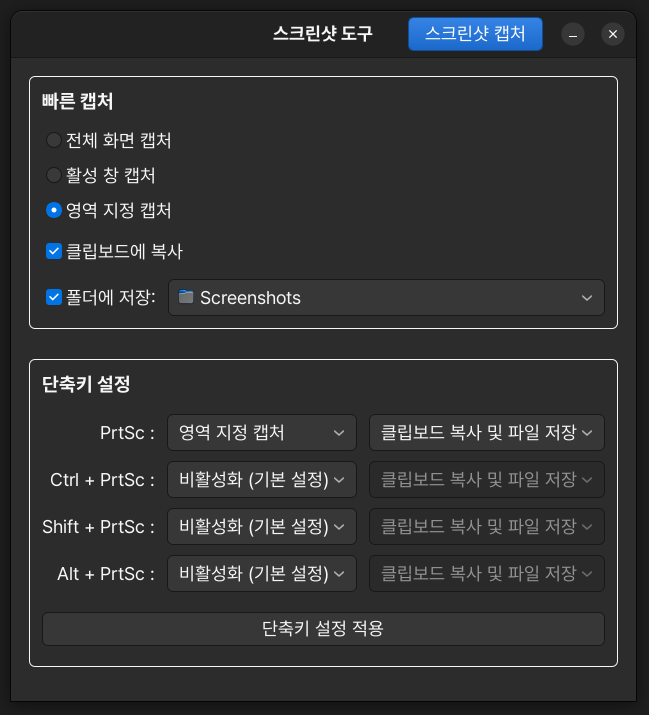

# 🐧 direct-screenshot 🍷

<p align="center">
  
</p>

리눅스 Wine 환경 카카오톡에 스크린샷을 바로 붙여넣을 수 있도록 하는 솔루션

*A universal solution for pasting screenshots into Wine applications on Linux.*

## Features

- **Wayland & X11 환경 지원:** 리눅스 데스크톱 환경(`Ubuntu 24.04` 등)에서 안정적으로 동작하도록 `gnome-screenshot`에 기반해 즉시 캡처를 수행합니다.
  - 단, 백그라운드 클립보드 데이터 주입을 위해 XWayland 호환성이 필요합니다.
- **Wine 클립보드 호환성:** CopyQ 엔진을 활용하여 단순한 `.PNG` 형식이 아닌 `.BMP` 형식을 포함한 14가지 MIME 타입으로 클립보드 데이터를 동시 주입합니다.
- **CLI 및 GUI 제공:** CLI 옵션 및 GUI 대화상자를 모두 제공하며, GUI 내에서 손쉽게 단축키 매핑 적용이 가능합니다.

## Prerequisites

실행을 위해 `gnome-screenshot`과 `copyq`패키지가 시스템에 반드시 설치되어 있어야 합니다.

```bash
sudo apt update
sudo apt install gnome-screenshot copyq python3-gi gir1.2-gtk-3.0 -y
```

## How to Run

```bash
git clone https://github.com/kmbzn/direct-screenshot.git
cd direct-screenshot
chmod +x direct-screenshot
./direct-screenshot
```

<p align="center">
  
</p>

- 설정 창 하단의 **단축키 설정** 영역에서 원하는 동작을 지정한 뒤 **단축키 설정 적용** 버튼을 누르면 GNOME 단축키에 즉시 등록됩니다.

## Usage & CLI Options

터미널에서 다양한 옵션을 사용할 수 있습니다.

```bash
usage: direct-screenshot [-h] [-i] [-a] [-w] [-s] [--no-clipboard] [--no-save] [-f PATH]

옵션 안내.
  -h, --help            도움말 표시 및 종료
  -i, --interactive     대화형 GUI 설정창 실행 (아무 옵션이 없을 때 기본값)
  -a, --area            마우스 드래그로 영역을 지정해 캡처
  -w, --window          특정 윈도우 선택 캡처
  -s, --screen          전체 화면 즉시 캡처
  -f PATH, --file PATH  지정한 PATH 경로에 스크린샷 직접 저장
  --no-clipboard        클립보드로 이미지 복사하지 않음 (파일 저장만 수행)
  --no-save             스크린샷 폴더에 파일로 저장하지 않음 (클립보드 복사만 수행)
```

## Environment & Specifications

| Component | Version / Specification
| - | -
| **Project Version** | `1.0`
| **OS** | `Ubuntu 24.04 LTS`
| **Desktop** | `GNOME 46.0`
| **Wine** | `Wine 11.0`
| **Python** | `Python 3.12.3`

## License

This project is licensed under the **GNU General Public License v2.0 (GPL 2.0)** - see the [LICENSE](LICENSE) file for details.

Created by **[kmbzn](https://kmbzn.com)**

If this tool saved your time, **please give it a ⭐!**