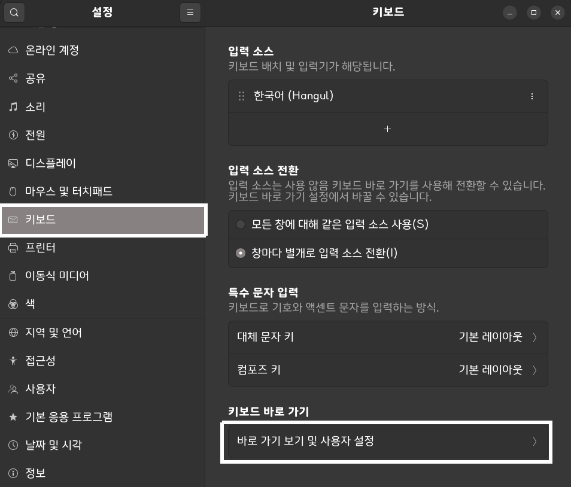
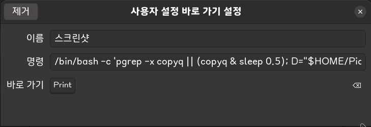

# 🐧 direct-paste-wine 🍷

리눅스 Wine 환경 카카오톡에 스크린샷을 바로 붙여넣을 수 있도록 하는 솔루션

A universal solution for pasting screenshots into Wine applications on Linux.

## 필수 도구 설치
아래 명령어 실행

```bash
sudo apt update
sudo apt install copyq gnome-screenshot -y
```

## 단축키 적용 방법

설정 → 키보드 → 키보드 바로 가기 → 바로 가기 보기 및 사용자 설정 → 추가(+) → 형식에 맞게 아래 내용 입력

| 항목 | 내용
| - | -
| 이름 | 스크린샷
| 명령 | (아래 `shortcut.sh` 명령어 붙여넣으세요)
| 바로 가기 | `PrtSc`



### `shortcut.sh` 명령어
```bash
/bin/bash -c 'pgrep -x copyq || (copyq & sleep 0.5); D="$HOME/Pictures/Screenshots"; mkdir -p "$D"; F="$D/$(date +%Y%m%d_%H%M%S).png"; gnome-screenshot -a -f "$F" && copyq copy image/png - < "$F"'
```

## 개요
리눅스(특히 Ubuntu Wayland) 환경에서 wine을 통해 실행되는 카카오톡 등의 앱에 이미지가 붙여넣어지지 않는 고질적인 문제를 해결합니다. 

이 프로젝트의 핵심 아이디어는 스크린샷 이미지를 클립보드에 주입할 때, CopyQ 엔진을 사용하여 단순한 `.PNG` 형식이 아닌 `.BMP` 형식을 포함한 14가지 MIME 타입으로 동시 주입하도록 하여 wine과 GNOME 간의 클립보드 호환성 장벽을 허무는 데 있습니다.

## 🚀 Quick Apply

### Install Prerequisites

Run the following command in your terminal:

```bash
sudo apt update
sudo apt install copyq gnome-screenshot -y
```

### Configure Keyboard Shortcut

Go to Settings → Keyboard → View and Customize Shortcuts → Custom Shortcuts → Add (+) and enter the following details:

| Field | Value
| - | -
| Name | Screenshot
| Command | *(Copy and paste the one-liner below)*
| Shortcut | `PrtSc` (or your preferred key)


#### The Core One-Liner (Command)

```bash
/bin/bash -c 'pgrep -x copyq || (copyq & sleep 0.5); D="$HOME/Pictures/Screenshots"; mkdir -p "$D"; F="$D/$(date +%Y%m%d_%H%M%S).png"; gnome-screenshot -a -f "$F" && copyq copy image/png - < "$F"'
```

> Note: Executing this single line triggers CopyQ to generate and inject 14+ compatible formats into the clipboard instantly.

## Overview
This project resolves the persistent issue where (screenshot) images fail to paste into apps like KakaoTalk running through Wine in Linux environments (especially Ubuntu Wayland). 
The core idea of this project is to use the CopyQ engine to inject images into the clipboard. Instead of using only the simple `.PNG` format, it simultaneously injects images in 14 different MIME types, including the `.BMP` format. This approach breaks down the clipboard compatibility barrier between Wine and GNOME.

## 🛠 Why it works?

Most Linux screenshot tools only provide `image/png`. However, Windows-based apps (legacy apps) often require `image/bmp` or other specific formats to recognize clipboard content. By piping the `.PNG` data through CopyQ, we force the clipboard to populate 14+ MIME types, fulfilling the requirements of the Wine environment.


## 🛠 Tested Environment

| | Version
| - | -
| OS | Ubuntu 22.04 LTS
| GNOME | GNOME Shell 42.9 (Wayland)
| HW | Lenovo ThinkPad X13 Gen1
| wine | wine-10.0
| Verified Apps | KakaoTalk (x64)

## License

This project is licensed under the **MIT License**.

Created by **[kmbzn](https://kmbzn.com)**

If this tool saved your time, **please give it a ⭐!**
